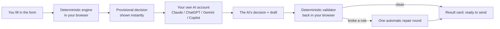

# Lead Follow-Up Rescue

Decide the right next step with one warm lead — **decision first, message
second** — then, only if that's genuinely the right move, draft the one
message to send. It runs on **your own AI account**, at zero cost to whoever
built or shared this tool: no server, no sign-up, no API key of ours.

> Not legal advice. See "An honest status" below before you rely on anything
> here for a real lead.

---

## What it decides

Every case resolves to exactly one of 11 plain-word outcomes. The tool never
drafts a message unless the decision allows one, and it never invents a
reason to keep chasing someone.

| Decision | In plain words |
|---|---|
| **Respond now** | They asked you something, or you promised them something, and it's still unanswered. Answer that first, even after many follow-ups. |
| **Wait** | They gave a time that hasn't arrived yet, or it's simply too soon. Don't reach out before then. |
| **Follow up** | No follow-up or one unanswered follow-up so far, and there's a real, still-open reason (like the proposal they're deciding on). |
| **Change the angle** | Two follow-ups went unanswered. Keep the same legitimate reason, but take a genuinely different approach, not a reworded reminder. |
| **Make it easy** | Three went unanswered. Ask one effortless yes/no or pick-one question, and nothing else. |
| **Close the loop** | Four or more went unanswered. End the chase gracefully: no question, no guilt, no disguised "one more thing." |
| **Stop following up** | They said no or asked you to stop (permanent: only *they* can reopen it), or said "not right now" with no timeframe (the chase ends, and no invented check-back date). |
| **Need more information** | A fact that would change the decision is missing, so it asks you (three questions at most) instead of guessing. |
| **Need a reason to follow up** | There's no genuine, specific reason to contact them right now. It asks you for one rather than inventing it. |
| **Out of scope** | Not one warm lead: cold or bulk outreach, debt collection, personal matters, or several leads at once. |
| **Nothing to do** | Nothing is pending or owed, or you've already closed the loop. |

The full rule set — what makes a stop permanent, how "not right now" is
read, how attempt counts work, what counts as a legitimate reason — is
`docs/design/TECHNICAL_DESIGN.md` (the source of truth). The recovered
product spec it was built from is `docs/spec/RECOVERED_SPEC.md`.

---

## Use it in 60 seconds

1. Open **`dist/lead-follow-up-rescue.html`** in any browser — double-click
   the file, or use the hosted link if your organization has published one.
   Nothing to install, nothing to sign up for.
2. Or, if you're signed in to Claude, open the published Claude version —
   the same tool with one added button:

   **https://claude.ai/artifact/SyqhsyMCehjBJMFmiKa6uH** (private until its
   owner shares it from the page's Share menu; each viewer's usage counts
   against their own Claude plan, and the first run asks permission).

3. Fill in the short form about your lead. A provisional decision appears on
   the right as you type — that's the deterministic engine, running with no
   AI call at all.
4. Click **Copy prompt for any AI** (or, on the Claude version, **Run with
   Claude**), get an answer, and paste it back into **Check an answer** to
   see a clean result card with anything that broke a rule flagged.

---

## How it works

Three things share one engine prompt and one deterministic core:

- **A form and a live decision.** The form asks only what the decision needs
  (progressive disclosure, never a long questionnaire), and a deterministic
  engine in your browser computes a provisional decision as you type — often
  with no AI call at all.
- **Your own AI, once.** Click **Copy prompt** (any AI) or **Run with
  Claude** (your own Claude account, inside the page). The AI reads the
  lead's actual words, decides, and — only if the decision allows it —
  drafts one message with one reason and one call to action.
- **A deterministic check, back in your browser.** Every AI answer is parsed
  and checked against the same rules: does the decision match the facts, is
  every quote actually in the case, is there exactly one reason and one
  call to action, no invented prices or links, no fake urgency, no "just
  checking in." If something's wrong, the tool offers one automatic repair
  round (or a copy-pasteable fix-it prompt in any-AI mode).



This is why the tool costs nothing to run for whoever built it: interpreting
the lead's words happens in *your* AI account; every rule that can be
checked mechanically is enforced for free, in the browser, before you ever
see a result. See `docs/design/TECHNICAL_DESIGN.md` §2 for the full delivery
model (including the Claude, ChatGPT, and Gemini setups for people who do
this every week).

---

## What the research says

Full write-up: `docs/research/INDUSTRY_RESEARCH.md`.

- **There's no rigorous evidence for a "right" number of follow-ups for a
  warm lead.** The commonly-quoted stats trace back to a 1942 survey with
  under 40 respondents, or to vendors selling cold-outreach tools. This
  tool's ladder (1 follow-up → new angle → make it easy → close the loop at
  4+) sits in the middle of how real sales tools actually behave, not on a
  cited "standard" (§B).
- **Speed on the *first* reply is the one place the evidence is strong.**
  Contacting a new inquiry within an hour makes it roughly 7× more likely to
  qualify than an hour later — this is why a brand-new question always gets
  "reply now" (§B1).
- **A stop is legally permanent, in every major jurisdiction checked.**
  "Stop," "remove me," and — in the UK/EU — even a plain "not interested"
  must end seller-initiated contact for good; only the lead reaching out
  again, or fresh consent, reopens it. This is stricter than the recovered
  product spec, and the design adopts the stricter reading (§A, DL-02).
- **A 1:1 sales follow-up email is still a commercial email under US law**
  (CAN-SPAM), even one-to-one, even B2B. It needs an honest subject line, a
  working opt-out, and a real postal address — which is why the tool adds
  that footer by default (§A2, DL-18).
- **Concrete beats vague, and guilt backfires.** Asking for a specific day
  and time books meetings meaningfully more often than an open-ended ask,
  and phrases like "haven't heard back" measurably *reduce* replies — one of
  the reasons the validator blocks that language outright (§B1).

---

## Open product decisions

Several rules were adopted with a working default so the build wouldn't
stall, but they're the product owner's call to confirm or change. Full
detail, basis, and status: `docs/design/TECHNICAL_DESIGN.md` §15.

- **DL-07 — An untimed commitment** ("I'll get back to you," no date given):
  currently asked once, then treated as a normal follow-up once the user
  confirms no timeframe was given.
- **DL-08 — The "typical practice" spacing table**: used only to label a
  suggested date and inform the AI's "too soon" judgment — it never sets the
  decision itself. Could be removed, tightened, or made the owner's own
  numbers.
- **DL-09 — Scope is one warm lead at a time**; cold or bulk outreach is
  explicitly out of scope for v1. Could be extended later, with the added
  compliance burden that bulk sending carries.
- **DL-17 — No closing line after a flat "not interested."** Right now that
  decision sends no message at all; the owner could instead choose one
  short, gracious acknowledgment line.
- **DL-26 — A shorter follow-up ladder for chat/SMS** (e.g. straight to
  "make it easy," then close): not implemented in v1; there's no evidence
  either way.

---

## An honest status

- **All deterministic tests pass.** `npm run typecheck` and `npm test` are
  green — the decision engine, the validator, the prompt assembler, and all
  three fixture suites (decision, output-integrity, robustness) run
  entirely in Node, in seconds, with no AI call and no cost.
- **No LLM evaluation has been run yet.** The optional cross-model harness
  (`eval/`) exists and is unit-tested, but running it for real needs your
  own API keys and spends real money — see `eval/README.md`. Until an
  `eval/reports/*.md` file exists for at least two model families (and the
  manual cross-app check has been done for the golden 10 cases), there is
  **no measured claim** about how any real chat AI performs with this
  prompt.
- **The benchmark numbers in the recovered product spec were
  self-evaluations** — the model that wrote the rules also graded its own
  answers against them. Treat every number in `docs/spec/RECOVERED_SPEC.md`
  as a starting point to re-measure, not a result to repeat.
- **This is not legal advice.** The compliance layer (`docs/design/
  TECHNICAL_DESIGN.md` §11) reflects a best-effort reading of US, UK/EU,
  Canadian, Australian and Philippine rules as researched on 2026-09-24. Laws
  and platform policies change; verify before relying on any specific claim.

---

## Repo map

```text
README.md                     this file
CHANGELOG.md
docs/
  spec/RECOVERED_SPEC.md       recovered product spec (background)
  audit/                       gap/conflict audit that fed the design
  research/                    industry & legal research (see above)
  design/
    TECHNICAL_DESIGN.md         the authoritative design
    TEST_PLAN.md                the authoritative test plan
  guides/INSTALL.md             seven ways to run this, in order
prompt/                        the portable prompt (FULL + COMPACT), source of truth
src/                           the deterministic core (engine, validator, prompt
                                assembler, parser) - zero runtime dependencies
src/generated/prompts.ts       prompt/*.md embedded as TS (generated, committed)
wrapper/                       the Rescue Desk UI, built to dist/
scripts/build.mjs              builds dist/ and skill/ from src/ + wrapper/ + prompt/
skill/lead-follow-up-rescue/   generated Claude Skill package
tests/
  fixtures/                    decision, integrity and robustness fixture catalogues
  unit/, fixtures.test.ts      deterministic unit + fixture suites (Vitest)
  ui/                          Playwright smoke tests against the built Desk
eval/                          optional cross-model evaluation harness (see eval/README.md)
dist/                          committed build outputs (the Desk, the Claude artifact body, prompts)
.github/workflows/ci.yml       typecheck + test + build (+ an optional UI job)
```

## Developer commands

```bash
npm install          # dev dependencies only; src/ has zero runtime dependencies
npm run typecheck     # tsc --noEmit, strict
npm test              # vitest run: unit tests + all three fixture suites
npm run build         # builds dist/ (the Desk, the Claude artifact, prompt copies) + skill/
npm run test:ui       # Playwright smoke tests against the built Desk (light/dark/phone)
npm run check         # typecheck + test + build + the prompt-size budget check
npm run eval          # the optional cross-model harness - see eval/README.md before running it
```

## Versioning

`ENGINE_VERSION`, `PROMPT_VERSION` (semver) and the output schema
(`lfr/1.0`) are exported from `src/types.ts` and shown in the Desk's footer
and the prompt's header. Any change to a decision rule updates, in the same
commit: `docs/design/TECHNICAL_DESIGN.md` §6/§15, the prompt, the affected
fixtures, and `CHANGELOG.md` — see `docs/design/TECHNICAL_DESIGN.md` §14.
